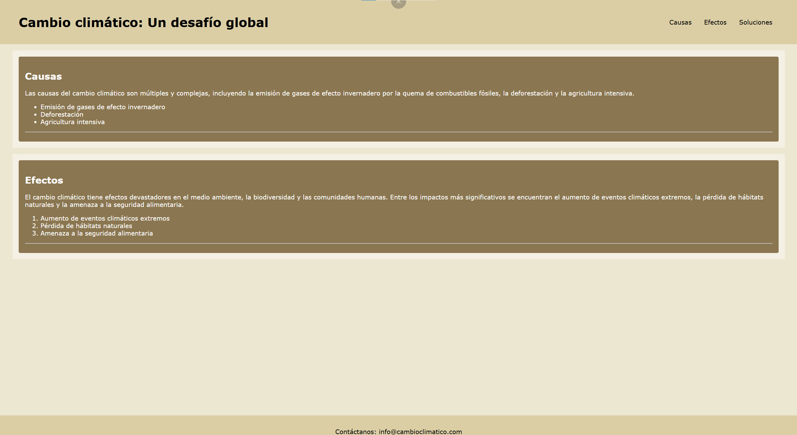

## Climate Change Web Page - v1 Edition

### 📒 English 📒

# 📰 Climate Change Awareness - Digital Edition 📰
Welcome to the Climate Change Web Page repository, a web design challenge focused on applying HTML5 semantic tags to shape the main structure and content of a webpage.

## 🎯 Project Objective
Develop a structured webpage exposing the causes and effects of climate change, strictly applying HTML5 semantic tags to ensure a clear information hierarchy and content organization.

## ✅ Compliance with Requirements
The project fully complies with the requested exercise, implementing the following semantic tags:

Header and Navigation (`<header>` and `<nav>`): Contains the main title "Cambio climático: Un desafío global". It includes a navigation menu with anchor links pointing to the different sections of the page.

Main Container (`<main>`): All core content regarding climate change is properly enclosed within the `<main>` tag.

Thematic Sections (`<section>`): The content is logically categorized using `<section>` tags to separate the topics into two distinct blocks: "Causas" (Causes) and "Efectos" (Effects).

Headings and Paragraphs (`<h2>`, `
`): Used effectively to provide clear titles for each section and descriptive text explaining the complexities of climate change.

Lists (`<ul>`, `<ol>`, `<li>`): Both list types were successfully implemented. An unordered list (`<ul>`) details the causes, while an ordered list (`<ol>`) highlights the sequence or severity of the effects.

Footer (`<footer>`): The closing section of the webpage includes direct contact information using a functional mailto link.

## 🧠 Architecture and Advanced Semantics
To ensure good code quality, the following semantic elements were applied:

Correct use of `<main>`: Clearly separates the main informational content from the header and footer.

Accessibility & Language: The lang="en" attribute is defined in the `<html>` tag. (Note: Since your content is in Spanish, for future iterations it is semantically recommended to change this to lang="es" to optimize screen readers and SEO).

## 🛠️ Technology Stack
HTML5: Web structuring and semantics.

CSS3: (Linked via `<link rel="stylesheet" href="./css/styles.css">`) Ready for typographic configuration and layout styling.

### 📕 Spanish 📕

# 📰 Concientización sobre el Cambio Climático - Edición Digital 📰
Bienvenido al repositorio de la página web sobre el Cambio Climático, un desafío de maquetación web enfocado en aplicar etiquetas semánticas de HTML5 para dar forma a la estructura principal y al contenido de la página.

## 🎯 Objetivo del Proyecto
Desarrollar una página web estructurada que exponga las causas y efectos del cambio climático, aplicando estrictamente etiquetas semánticas de HTML5 para garantizar una jerarquía de información clara y una correcta organización del contenido.

## ✅ Cumplimiento de Requerimientos
El proyecto cumple al 100% con el ejercicio solicitado, implementando las siguientes etiquetas semánticas:

Cabecera y Navegación (`<header>` y `<nav>`): Contiene el título principal "Cambio climático: Un desafío global". Incluye un menú de navegación principal con enlaces ancla dirigidos a las diferentes secciones de la página.

Contenedor Principal (`<main>`): Todo el contenido central sobre el cambio climático está correctamente envuelto en la etiqueta `<main>`.

Secciones Temáticas (`<section>`): El contenido está categorizado lógicamente utilizando etiquetas `<section>` para separar las temáticas en dos bloques distintos: "Causas" y "Efectos".

Encabezados y Párrafos (`<h2>`, `
`): Utilizados de manera efectiva para proporcionar títulos claros a cada sección y texto descriptivo que explica la complejidad del cambio climático.

Listas (`<ul>`, `<ol>`, `<li>`): Se implementaron con éxito ambos tipos de listas. Una lista no ordenada (`<ul>`) detalla las causas, mientras que una lista ordenada (`<ol>`) destaca los efectos.

Pie de Página (`<footer>`): El cierre de la página web incluye información de contacto directo utilizando un enlace mailto funcional.

## 🧠 Arquitectura y Semántica Avanzada
Para asegurar una buena calidad del código, se aplicaron los siguientes elementos semánticos:

Uso correcto de `<main>`: Separa claramente el contenido informativo principal de la cabecera y el pie de página.

Accesibilidad e Idioma: Se definió el atributo lang="en" en la etiqueta `<html>`. (Nota: Dado que tu contenido está en español, para futuras iteraciones es semánticamente recomendable cambiarlo a lang="es" para optimizar los lectores de pantalla y el SEO).

## 🛠️ Stack Tecnológico
HTML5: Estructuración y semántica web.

CSS3: (Vinculado mediante `<link rel="stylesheet" href="./css/styles.css">`) Preparado para la configuración tipográfica y el diseño del layout.