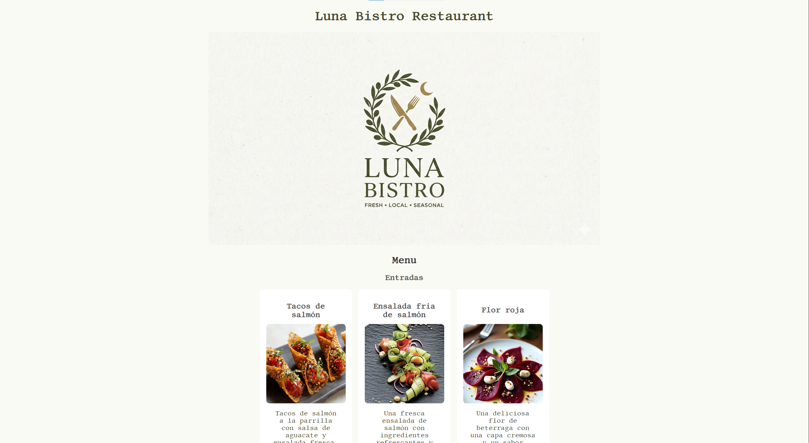

# Luna Bistro Restaurant - v1 Edition

### 📒 English 📒

## 📰 Luna Bistro Restaurant - Digital Menu 📰
Welcome to the Luna Bistro Restaurant repository, a web design project focused on building an attractive, structured, and responsive digital menu utilizing semantic HTML5 and CSS3 Flexbox layout.

# 🎯 Project Objective
Develop the front-end interface of an online restaurant menu, ensuring a clear visual hierarchy for the dishes and implementing a flexible, card-based layout that adapts to different screen sizes.

### ✅ Compliance with Requirements
The project successfully implements the following structural and design elements:

1. Header (`<header>`): Contains the main identity of the restaurant with an `<h1>` tag for "Luna Bistro Restaurant".

2. Thematic Sections (`<section>`): The menu content is logically categorized using `<section>` tags, separating the layout into clear blocks: Logo, Starters (Entradas), Main Courses (Platos principales), and Desserts (Postres).

3. Menu Item Cards (`
`): Each dish functions as an individual card within its respective container. It is structured internally with a specific title (`<h3>`), an appetizing image (`` with `alt` text for accessibility), and a descriptive paragraph (`
`).

4. Footer (`<footer>`): The closing section of the webpage includes copyright details, physical address, phone number, and email contact information.

### 🧠 Architecture and Advanced Semantics
To ensure high code quality and visual consistency, the following techniques were applied:

Correct use of `<main>`: All core content (the entire menu and logo) is enclosed within the `<main>` tag, clearly indicating the core of the webpage.

Flexbox Layout: Implementation of `display: flex;` with `flex-wrap: wrap;` in the CSS containers to create a responsive grid system that automatically adjusts the dish cards based on the screen width.

Typography and Styling: Integration of the external Google Font "Libertinus Mono" to enhance the brand's aesthetic, alongside image optimization using `object-fit: cover` to maintain uniform image dimensions without distortion.

### 🛠️ Technology Stack
HTML5: Web structuring and semantics.

CSS3: Custom typography, color palette configuration, and Flexbox-based layout.

### 📕 Spanish 📕

## 📰 Luna Bistro Restaurant - Menú Digital 📰
Bienvenido al repositorio de Luna Bistro Restaurant, un proyecto de maquetación web enfocado en la construcción de un menú digital atractivo, estructurado y responsivo utilizando HTML5 semántico y CSS3 con diseño Flexbox.

# 🎯 Objetivo del Proyecto
Desarrollar la interfaz front-end de un menú de restaurante online, asegurando una jerarquía visual clara para los platos e implementando un diseño flexible basado en tarjetas que se adapta a diferentes tamaños de pantalla.

### ✅ Cumplimiento de Requerimientos
El proyecto implementa con éxito los siguientes elementos estructurales y de diseño:

1. Cabecera (`<header>`): Contiene la identidad principal del restaurante con una etiqueta `<h1>` para "Luna Bistro Restaurant".

2. Secciones Temáticas (`<section>`): El contenido del menú está categorizado lógicamente utilizando etiquetas `<section>`, separando el diseño en bloques claros: Logo, Entradas, Platos principales y Postres.

3. Tarjetas de Platos (`
`): Cada plato funciona como una tarjeta individual dentro de su respectivo contenedor. Se ha estructurado internamente con un título específico (`<h3>`), una imagen apetitosa (`` con texto `alt` para accesibilidad) y un párrafo descriptivo (`
`).

4. Pie de Página (`<footer>`): El cierre de la página web incluye detalles de derechos de autor, dirección física, número de teléfono e información de contacto por correo electrónico.

### 🧠 Arquitectura y Semántica Avanzada
Para asegurar una alta calidad del código y consistencia visual, se aplicaron las siguientes técnicas:

Uso correcto de `<main>`: Todo el contenido central (el menú completo y el logotipo) está envuelto en la etiqueta `<main>`, indicando claramente cuál es el núcleo de la página web.

Diseño Flexbox: Implementación de `display: flex;` con `flex-wrap: wrap;` en los contenedores CSS para crear un sistema de cuadrícula responsivo que ajusta automáticamente las tarjetas de los platos según el ancho de la pantalla.

Tipografía y Estilos: Integración de la fuente externa de Google "Libertinus Mono" para mejorar la estética de la marca, junto con la optimización de imágenes mediante `object-fit: cover` para mantener dimensiones uniformes sin distorsión.

### 🛠️ Stack Tecnológico
HTML5: Estructuración y semántica web.

CSS3: Tipografía personalizada, configuración de paleta de colores y layout basado en Flexbox.